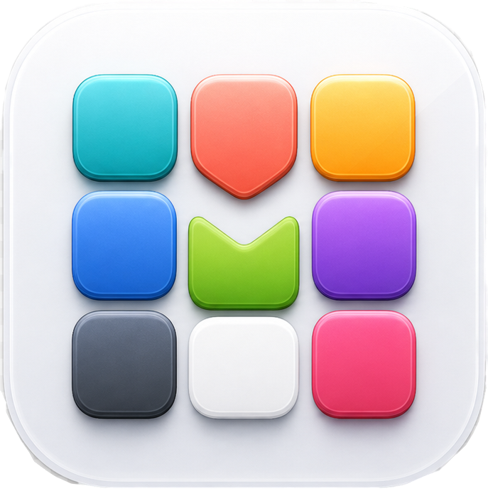
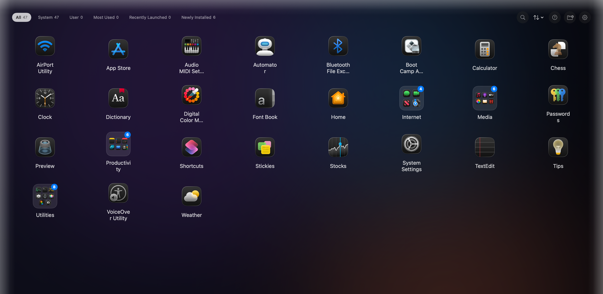
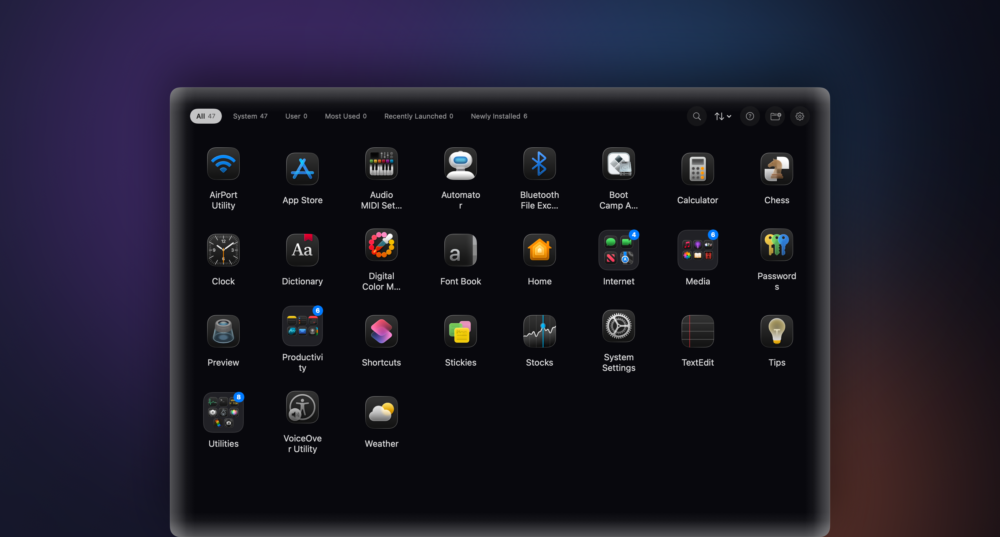
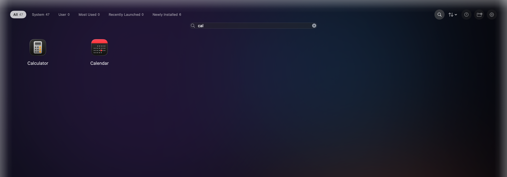
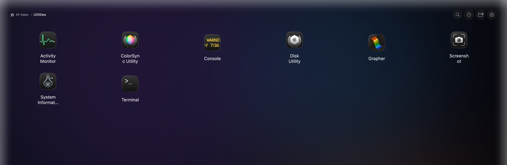
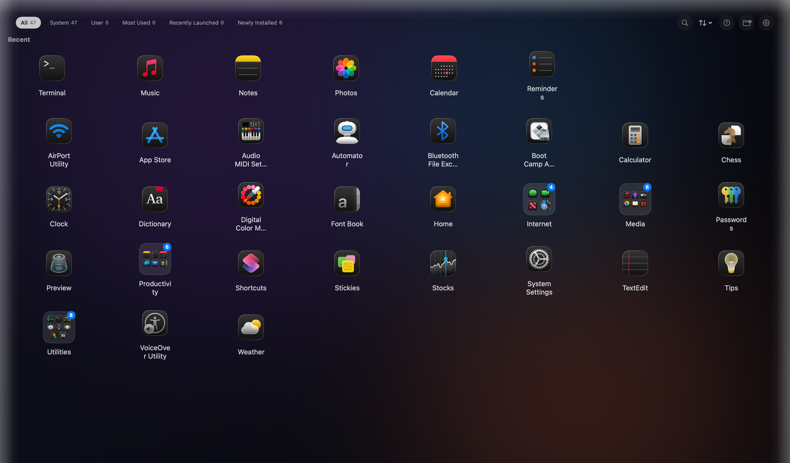
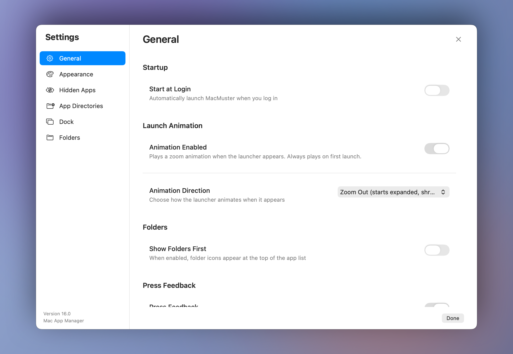

# MacMuster

<div align="center">



**A beautiful, fast, and fully-featured macOS app launcher — built with Swift & SwiftUI**

**The Place where your Mac Apps gather!!**

[](https://swift.org)
[](https://apple.com/macos)
[](LICENSE)
[](https://github.com)

</div>

---

## 🌟 Overview

MacMuster is a **native macOS app launcher** that provides a beautiful overlay interface — shown as a Window, Full Screen (Launchpad-style), or Maximized, your choice — with powerful keyboard navigation, type-to-search, smart categorization, folder organization, backup/restore, and a convenient menu bar presence.

Built entirely with **Swift 6.2** and **SwiftUI + AppKit**, MacMuster has zero external dependencies and follows modern macOS development best practices.

---

## ✨ Features

### 🚀 Core Features

| Feature | Description |
|---------|-------------|
| **Launcher Window** | Window / Full Screen / Maximized presentation — pick how the launcher shows up (see below) |
| **Type-to-Search** | Just start typing — no need to click or press `/` first, like Spotlight/Alfred/Raycast |
| **Real-Time Search** | Fuzzy & path matching (catches acronyms, vendor names) |
| **Keyboard Navigation** | Full arrow-key, Enter, Escape, and `/` search support |
| **Smart Categories** | All / System / User / Most Used / Recently Launched / Newly Installed |
| **Folder Organization** | Create, rename, delete folders; drag apps into folders; folder icons show a live app-count badge and an adaptive mini-grid of member icons |
| **Drag & Drop** | Drag apps onto each other to create folders or reorder |
| **Recent Apps** | Most recently launched apps, max 8 visible (history retained 14 days); can be hidden from Settings |
| **Menu Bar Access** | Quick toggle, Export/Restore Backup, and Quit from the menu bar icon |
| **Backup & Restore** | Export all folders, preferences, and hidden-app state to a JSON file; restore with a preview showing which apps are still installed before applying |
| **Multi-Monitor** | Launcher opens on the display under your cursor; dimmed backgrounds on other displays; reacts to display changes |
| **Accessibility** | Keyboard shortcuts help, screen reader support, reduce motion/transparency, non-color selection cues, visible keyboard focus rings |
| **Provenance Badge** | Apps installed outside `/Applications`/`/System/Applications` (e.g. `~/Applications`) show a warning badge |

### ⚡ Performance

- **< 100ms** cold launch time
- **Lazy icon loading** with batching (60 icons per chunk, priority-first)
- **Staleness-aware scanning** — skips a rescan entirely if no scanned directory has changed since the last one
- **Persistent icon cache** — SHA256-keyed on-disk cache with mtime invalidation, per-appearance (light/dark) variants
- **Release binary: ~1.2MB** (stripped)

### 🎨 Customization

- **Launch Mode**: Window / Full Screen / Maximized — how the launcher itself is presented
- **Presentation Style**: Glass (frosted blur) or Sheet (solid), plus an optional tint color & strength
- **Grid columns**: 4–10 columns
- **Icon sizes**: Small / Medium / Large / Extra Large
- **Sort options**: Name (A–Z) or Installation Date
- **Show Folders First**: Pin folders ahead of apps in the grid
- **Font family, size, weight**: Full typography control
- **Dark/Light mode**: Automatic + manual toggle
- **Auto-refresh**: Configurable intervals (5 min – 1 hour)
- **Launch Animation**: Zoom In or Zoom Out on open, or disable entirely
- **Press Feedback**: Toggle the tap/click visual feedback on app icons
- **Show Recent Apps**: Toggle the "Recent" section on or off

### 🪟 Launch Mode

Controls how the MacMuster launcher window itself appears when opened — this is
independent of how the apps you launch behave:

| Mode | Behavior |
|------|----------|
| **Window** | A centered, resizable window sized to ~60% of the display, with the Dock and menu bar left visible |
| **Full Screen** | Covers the entire display (including the notch/menu-bar area) and auto-hides the Dock and menu bar, Launchpad-style |
| **Maximized** | Fills the display's visible working area, but leaves the Dock and menu bar in place |

Set from **Settings → Appearance → Launch Mode**. Changes apply immediately the next time the launcher opens.

### ✨ Glow Effect

Enhanced visual edge glow with customizable options:

| Setting | Description |
|---------|-------------|
| **Enabled** | Toggle glow effect on/off |
| **Color** | 8 preset swatches (White, Black, Orange, Blue, Pink, Green, Cyan, Yellow) or any custom color via the system color picker |
| **Intensity** | 0–1 (default: 0.3) - Controls brightness |
| **Width** | 5–40 pixels (default: 40px) - Edge gradient size |

The glow effect smoothly fades from full opacity at the screen edges to transparent inward, creating a soft neon-like border around the launcher.

> **Note**: The glow is rendered behind all UI content and won't cover keyboard shortcuts or other elements.

### 🔒 Privacy & Security

- **Zero network calls** — completely offline
- **Local storage only** — UserDefaults for preferences, declared in a `PrivacyInfo.xcprivacy`
  manifest (same-app-only access, no tracking, no collected data types)
- **No analytics, no tracking**
- **Provenance badge** — apps outside `/Applications`/`/System/Applications` are flagged, since a
  malicious bundle could otherwise impersonate a real app's name/icon from elsewhere
- **Bounded launch history** — recent/most-used app data is capped to 14 days and 50 entries, well
  above the 8 ever shown but far short of indefinite retention
- **Security-scoped bookmarks** for custom scan directories, so access is primed to survive
  relaunch if App Sandbox is ever enabled (the app ships unsandboxed today)

---

## 📸 Screenshots

<div align="center">

| Full Screen | Windowed |
|:---:|:---:|
|  |  |

| Search & Filter | Folder View |
|:---:|:---:|
|  |  |

| Recent Apps | Settings |
|:---:|:---:|
|  |  |

</div>

---

## 🆚 Why MacMuster?

MacMuster takes a different approach from other Mac launchers. Here's how it stands apart:

| | MacMuster | Others |
|---|:---:|:---:|
| **Tech stack** | Pure Swift/SwiftUI + AppKit | Mixed (web, native, built-in) |
| **Dependencies** | Zero external deps | Varies (runtime engines common) |
| **Binary size** | ~1.2 MB stripped | ~5 MB – Built-in |
| **UI style** | Visual grid with app icons | Text-based interfaces |
| **Folder organization** | Drag-and-drop folders with live icon grids | Not available |
| **Launch modes** | Window / Full Screen / Maximized | Single overlay |
| **Glow effect** | Customizable edge glow (8 colors, intensity, width) | Not available |
| **Provenance badge** | Flags apps outside /Applications | Not available |
| **Multi-monitor** | Opens on cursor display, dims other displays | Single display |
| **Network access** | Completely offline | Varies (most have internet features) |
| **Pricing** | Free & open source (MIT) | Free, Free+paid subscription, or Free+one-time |
| **AI features** | None (by design) | Limited or requires subscription |
| **Extension ecosystem** | Not needed — everything built-in | Varies (1,650+ extensions, workflows, or none) |
| **Backup & restore** | Full JSON export/import with preview | Limited or cloud-dependent |
| **Privacy** | No analytics, no tracking, no telemetry | Analytics or telemetry common |

### MacMuster's philosophy

- **Native first** — Built entirely with Swift and AppKit/SwiftUI. No JavaScript runtime, no web views, no Electron. Just pure macOS performance.
- **Visual, not textual** — A beautiful grid of app icons you can browse, not a command line you have to type into. See all your apps at a glance.
- **Folders that feel like folders** — Drag apps onto each other to create folders. Each folder shows a live mini-grid of its contents. No other launcher does this.
- **Zero distractions** — No AI, no extensions marketplace, no account sign-up, no cloud sync. Just launch your apps and get back to work.
- **Your data stays yours** — Completely offline. No network calls. No analytics. No tracking. Your app usage history never leaves your Mac.
- **Free, forever** — MIT licensed. No subscriptions, no paid upgrades, no feature gates.

### Shy MacMuster?

MacMuster is polite — it gets out of your way the moment you launch an app. No lingering overlay, no extra keystroke to dismiss it. Click an app, and MacMuster quietly steps aside so you can focus on what you opened.

Other launchers hang around after launching, forcing you to hit Escape or click away. MacMuster knows its job is done and disappears instantly — no fuss, no extra step.

---

## 🛠 Requirements

| Requirement | Version |
|-------------|---------|
| macOS | 14.0 (Sonoma) or later |
| Xcode / Swift | 15.0+ / Swift 6.2 |
| Architecture | Apple Silicon (arm64) |

---

## 📦 Installation

### Option 1: Download Pre-built Release (Recommended)

1. Download `MacMuster.app` from [Releases](https://github.com/MacMuster/releases)
2. Drag to `/Applications`
3. Right-click → **Open** (first launch only, due to ad-hoc signing)

### Option 2: Build from Source

```bash
# Clone the repository
git clone https://github.com/MacMuster/macos-launcher.git
cd macos-launcher

# Build production release
./build_production.sh

# Install
cp -R MacMuster.app /Applications/
```

### Option 3: Development Build

```bash
# Debug build
swift build

# Run directly
swift run MacMuster
```

---

## 🚀 Usage

### Keyboard Shortcuts

| Key | Action |
|-----|--------|
| Start typing | Instantly search, no click or `/` needed |
| `↑ ↓ ← →` | Navigate grid |
| `Enter` | Launch selected app (or open folder) |
| `Escape` | Close launcher (or unfocus search, or step out of a folder) |
| `Backspace/Delete` | Step up one level when inside a folder |
| `/` | Focus search field |
| `⌘Q` | Quit MacMuster |

### Menu Bar

- **Left-click** menu bar icon → Show/hide launcher
- **Right-click** menu bar icon → Full menu (Show MacMuster, Export/Restore Backup, Settings, Quit)
- **Export Backup / Restore Backup** → Save or load folders, preferences, and hidden-app state as a JSON file (restore shows a preview of any apps no longer on disk before applying)

### Folders

1. Right-click any app → **Add to Folder**
2. Create new folder or add to existing
3. Click folder in grid to open
4. Right-click folder → Rename / Delete

### Settings

Open via **Gear icon** in launcher or **Settings** from menu bar:
- General (start at login, launch animation, folders-first, press feedback, recent apps, refresh)
- Appearance (glow effect, font, layout, icon size, overlay opacity, presentation mode, tint, launch mode)
- Hidden Apps (toggle visibility)
- App Directories (custom scan paths)
- Dock (show/hide in Dock)
- Folders (manage, rename, delete folders)

---

## 🏗 Architecture

```
MacMuster/
├── Sources/MacMuster/
│   ├── AppEntry.swift           # @main entry point
│   ├── AppDelegate.swift        # App lifecycle, singletons
│   ├── AppModel.swift           # Core state (@Observable), orchestrates the pieces below
│   ├── SettingsAppearance.swift # Appearance/behavior settings (launch mode, glow, tint, animation...)
│   ├── LibraryScanState.swift   # Scanned app library, hidden-apps, icon loading
│   ├── LibraryScanState+Display.swift # Display ordering, search ranking, category management
│   ├── NavigationSelection.swift # Keyboard grid navigation + selection state
│   ├── Types.swift              # Application/AppFolder/LaunchMode models + shared constants
│   ├── ContentView.swift        # Main launcher UI
│   ├── AppContextMenu.swift     # Context menus for apps and folders
│   ├── SearchBarView.swift      # Search bar and search icon button
│   ├── CategoryTabView.swift    # Category filter tab button
│   ├── ToolbarIconChrome.swift  # Shared hover/active chrome for toolbar icon buttons
│   ├── OverlayWindowManager.swift   # Launcher window mgmt (Window/Full Screen/Maximized) + glow effect
│   ├── StatusBarManager.swift       # Menu bar icon, Export/Restore Backup, Quit
│   ├── SettingsWindowManager.swift  # Settings window
│   ├── SettingsContentView.swift    # Settings UI
│   ├── Constants.swift              # Magic numbers
│   └── Services/
│       ├── ApplicationScanner.swift   # Directory scanning, custom-dir validation
│       ├── ApplicationService.swift   # App launching
│       ├── ApplicationSorter.swift    # Sorting logic
│       ├── BackupManager.swift        # Export/import folders + preferences as JSON
│       ├── RestorePreviewPanel.swift  # Restore preview UI (flags apps no longer on disk)
│       ├── FolderStore.swift          # Folder CRUD, child-folder traversal
│       ├── IconService.swift          # Icon loading/caching, folder composite icons
│       ├── IconCacheManager.swift     # On-disk icon cache, invalidated on bundle updates
│       ├── PreferencesStore.swift     # UserDefaults persistence (single source of truth)
│       ├── AlertHelper.swift          # Shared NSAlert presentation helpers
│       ├── RecentAppsTracker.swift    # Recent/most-used launch history
│       └── DirectoryWatcher.swift     # FSEvents-based install/remove detection
├── MacMuster.xcassets/              # Asset catalog (light/dark app icon variants)
├── Resources/                     # Icons, PrivacyInfo.xcprivacy, Localizable.xcstrings
├── Tests/                         # Unit tests (27 test files, 455 tests)
├── Package.swift                  # SPM manifest
├── build_common.sh                # Shared build config (resource list, asset-catalog compile)
├── build_production.sh            # Production build script
└── create_app_bundle.sh           # Local dev bundle script
```

### Key Design Decisions

| Decision | Rationale |
|----------|-----------|
| `@Observable` + SwiftUI | Modern, performant state management |
| Hybrid AppKit/SwiftUI | Native window control + declarative UI |
| Background scanning | Non-blocking UI, configurable refresh cycle |
| NSCache + disk cache | Memory-bounded, mtime-aware invalidation |
| Path-based identity | Stable `ForEach` identifiers |

---

## 🧪 Testing

```bash
# Run all tests
swift test

# Run specific test
swift test --filter AppModelTests/testSearchFilterCaseInsensitive

# With coverage
swift test --enable-code-coverage
```

---

## 📦 Distribution

### For Mac App Store

1. Enable **App Sandbox** in entitlements
2. Use **Developer ID Application** certificate
3. Submit via **Transporter** / Xcode Organizer

### For Direct Distribution

```bash
# 1. Sign with Developer ID
codesign --sign "Developer ID Application: Your Name" \
         --options runtime \
         --entitlements entitlements.plist \
         MacMuster.app

# 2. Notarize
xcrun notarytool submit MacMuster.app \
        --apple-id "your@email.com" \
        --team-id "TEAM123" \
        --wait

# 3. Staple ticket
xcrun stapler staple MacMuster.app
```

---

## 🤝 Contributing

1. Fork the repository
2. Create feature branch (`git checkout -b feature/amazing-feature`)
3. Commit changes (`git commit -m 'Add amazing feature'`)
4. Push to branch (`git push origin feature/amazing-feature`)
5. Open a Pull Request

### Code Style

- SwiftFormat + SwiftLint (run `swift format` before commit)
- `@MainActor` for all UI classes
- `@Observable` for state objects
- Comprehensive error handling

---

## 📄 License

Distributed under the **MIT License**. See `LICENSE` for more information.

---

## 🙏 Acknowledgments

### Frameworks & Tools
- **Apple** — Swift, SwiftUI, AppKit frameworks

### AI-Assisted Development
This project has benefited from AI-assisted code review and development:
- **Claude (Opus/Fable)** — Security enhancements, vulnerability assessments, and security-focused code reviews
- **DeepSeek & QWEN** — Performance profiling, optimization strategies, and bug diagnosis
- **ChatGPT** — App name suggestions and icon design concepts
- **Contributors** — All who helped improve MacMuster

---

<div align="center">

**Made In BHARATH with ❤️ for macOS**

[Report Bug](https://github.com/yourusername/MacMuster/issues) · [Request Feature](https://github.com/yourusername/MacMuster/issues) · [Discussions](https://github.com/yourusername/MacMuster/discussions)

</div>
